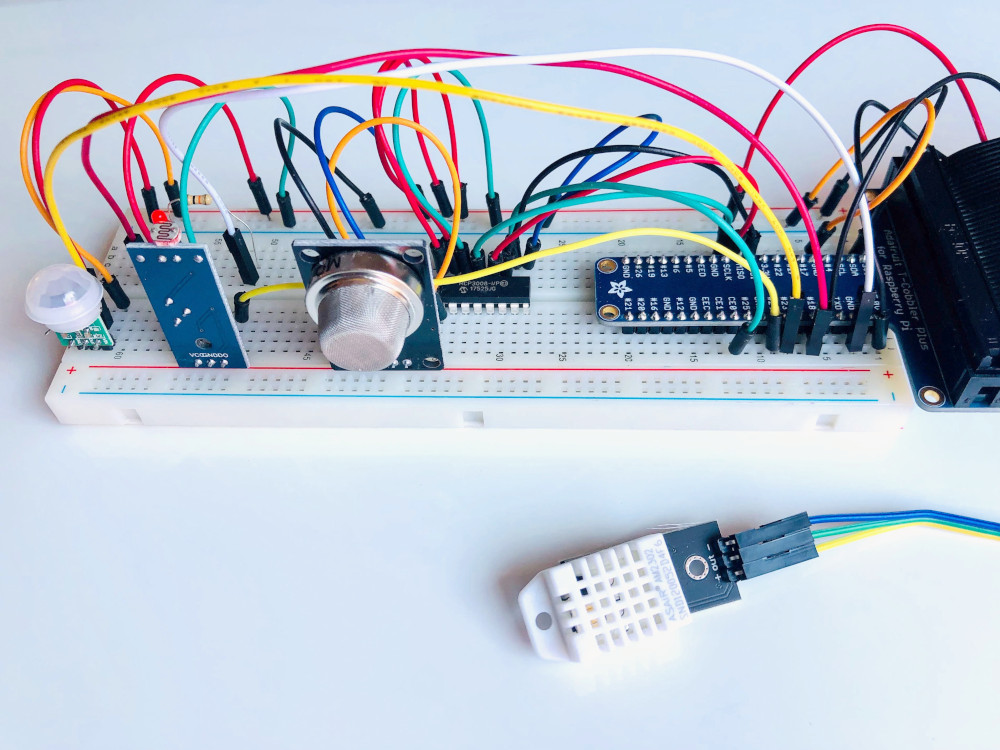

# IoT Telemetry Dataset

## About Dataset

### Context
Environmental sensor telemetry data, detailed in the blog post, [Getting Started with IoT Analytics on AWS](https://towardsdatascience.com/getting-started-with-iot-analytics-on-aws), published on Towards Data Science.

**Dataset Source:** [Environmental Sensor Data - Kaggle](https://www.kaggle.com/datasets/garystafford/environmental-sensor-data-132k?resource=download)

### Content
The data was generated from a series of three identical, custom-built, breadboard-based sensor arrays. Each array was connected to a Raspberry Pi device. Each of the three IoT devices was placed in a physical location with varied environmental conditions.

| Device ID         | Environmental Conditions                 |
|-------------------|------------------------------------------|
| 00:0f:00:70:91:0a | Stable conditions, cooler and more humid |
| 1c:bf:ce:15:ec:4d | Highly variable temperature and humidity |
| b8:27:eb:bf:9d:51 | Stable conditions, warmer and dryer      |

Each IoT device collected a total of seven different readings from the four sensors on a regular interval. Sensor readings include temperature, humidity, carbon monoxide (CO), liquid petroleum gas (LPG), smoke, light, and motion. The data spans the period from **07/12/2020 00:00:00 UTC – 07/19/2020 23:59:59 UTC**. There is a total of **405,184 rows** of data.

The sensor readings, along with a unique device ID and timestamp, were published as a single message, using the ISO standard Message Queuing Telemetry Transport (MQTT) network protocol. Below is an example of an MQTT message payload:

```json
{
  "data": {
    "co": 0.006104480269226063,
    "humidity": 55.099998474121094,
    "light": true,
    "lpg": 0.008895956948783413,
    "motion": false,
    "smoke": 0.023978358312270912,
    "temp": 31.799999237060547
  },
  "device_id": "6e:81:c9:d4:9e:58",
  "ts": 1594419195.292461
}
```

## Dataset Schema

There are nine columns in the dataset:

| Column   | Description          | Units      |
|----------|----------------------|------------|
| ts       | Timestamp of event   | Epoch      |
| device   | Unique device name   | String     |
| co       | Carbon monoxide      | ppm (%)    |
| humidity | Humidity             | Percentage |
| light    | Light detected?      | Boolean    |
| lpg      | Liquid petroleum gas | ppm (%)    |
| motion   | Motion detected?     | Boolean    |
| smoke    | Smoke                | ppm (%)    |
| temp     | Temperature          | Fahrenheit |

## Sensor Setup



*Detail image showing the sensor array setup used to collect the telemetry data.*